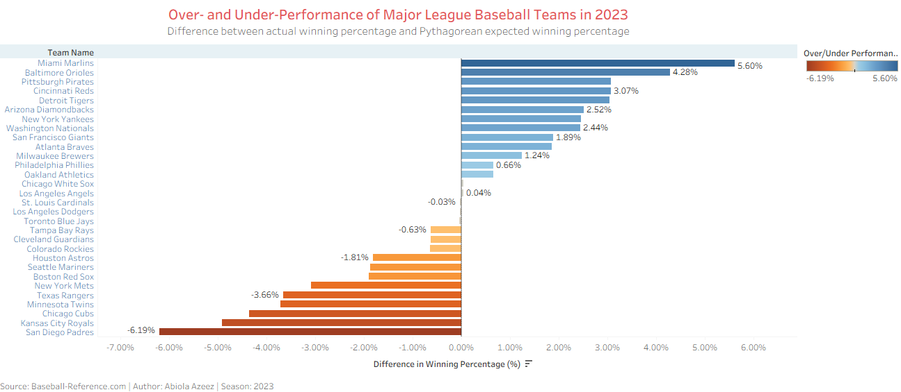
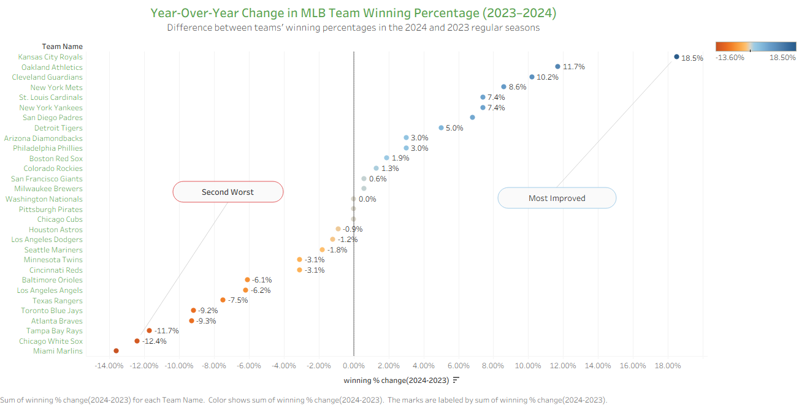

# MLB Team Performance Visualization

## Project Overview
This project analyzes Major League Baseball team performance using data visualization techniques in Tableau. The analysis compares predicted team performance with actual results and examines how team performance changed between seasons.

The objective of this project is to demonstrate how visualization tools can be used to identify trends, highlight outliers, and communicate insights clearly.

---

## Objectives

- Compare predicted vs actual team performance
- Identify teams that overperformed or underperformed expectations
- Analyze year-over-year performance changes across MLB teams
- Communicate insights using effective data visualizations

---

## Dataset Description

The dataset contains team-level performance statistics including:

- Team name
- Season year
- Predicted winning percentage
- Actual winning percentage
- Performance difference

These variables allow comparison between expected and observed team performance.

---

## Tools Used

- Tableau
- Data Visualization
- Calculated Fields
- Comparative Analysis

---

## Visualizations

### Performance Difference (Actual vs Predicted)

This visualization highlights teams whose actual performance significantly differed from predictions.

---

### Year-over-Year Performance Change

This chart shows how each team's winning percentage changed from 2023 to 2024, helping identify the most improved and most declined teams.

---

## Key Insights

- Some teams significantly exceeded performance expectations.
- Other teams underperformed relative to predictions.
- Visual comparison of predicted vs actual performance helps identify teams whose outcomes diverged from expectations.
- Year-over-year analysis highlights which teams improved or declined the most between seasons.

---

## Author

**Abiola Azeez**  
Post-Baccalaureate Certificate in Data Analytics  
University of the Fraser Valley

GitHub: https://github.com/Abiola-Azeez
